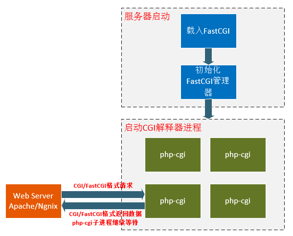

### 基础

在整个网站架构中, Web Server(如Apache)只是内容的分发者. 客户端请求静态资源, 如html, css, js等, 则web server
会去文件系统中查找这个文件, 并发送给浏览器.


客户端请求的是动态资源, 如index.php, 根据配置文件, web server知道这个不是静态资源, 需要去找php解释器来处理, 那么
web server会把这个请求简单处理, 然后交给php解释器.


动态资源请求处理:  当Web Server收到 index.php 这个请求后, 会启动对应的 CGI 程序, 这里就是PHP的解析器.接下来PHP
解析器会解析php.ini文件, 初始化执行环境, 然后处理请求, 再以规定CGI规定的格式返回处理后的结果,退出进程, Web server
再把结果返回给浏览器.

**CGI**,  公共网关接口(Common Gateway Interface). web server 和web application之间交换的一种协议. [接口]

**FastCGI**, 同CGI, 是对CGI在效率上做了一些优化. SCGI协议和FastCGI类似. [接口]

**PHP-CGI**, 是PHP (Web Application)对Web Server提供的`CGI协议`的接口程序 [实现]

**PHP-FPM**, 是PHP (Web Application)对Web Server提供的`FastCGI协议`的接口程序, 额外还提供了相对智能一些的
任务管理. [实现]

说明: Web Application一般指PHP, Java, 等应用程序. Web Server一般指的Apache, Nginx, IIS, Tomcat等服务器.


### CGI

CGI, (Common Gateway Interface). web server 和web application进行"交谈"的一种工具, 其程序必须运行在网络服务器上.
CGI可以用任何一种语言编写, 只要这种语言具有标准输入、输出和环境变量.

cgi原理:  web server收到用户请求, 就会把请求提交给cgi程序(如php-cgi),  cgi程序根据请求提交的参数作应处理(解析php),
然后输出标准的html语句，返回给web server, web server 再返回给客户端.


### FastCGI

FastCGI接口方式采用C/S结构, 可以将HTTP服务器和脚本解析服务器分开, 同时在脚本解析服务器上启动一个或者多个脚本解析守护进程.
当HTTP服务器每次遇到动态程序时, 可以将其直接交付给FastCGI进程来执行, 然后将得到的结果返回给浏览器. 这种方式可以让HTTP服务器
专一地处理静态请求, 或者将动态脚本服务器的结果返回给客户端, 这在很大程度上提高了整个应用系统的性能.



```
1. Web Server启动时载入FastCGI进程管理器
2. FastCGI进程管理器自身初始化,启动多个CGI解释器进程(PHP-CGI或PHP-FPM),并等待来自Web Server的连接.
3. 当客户端请求到达Web Server时，FastCGI进程管理器选择并连接到一个CGI解释器.
4. CGI解释器处理完毕后, 将标准输出和错误信息从同一连接返回Web Server.
```


### PHP-CGI 与 PHP-FPM

- PHP-CGI就是PHP实现的自带的FastCGI管理器.(官方, 缺点: 不能平滑重启; kill掉PHP-CGI, php程序不能运行)

- PHP-FPM 是对于 FastCGI 协议的具体实现, 他负责管理一个进程池, 来处理来自Web服务器的请求.